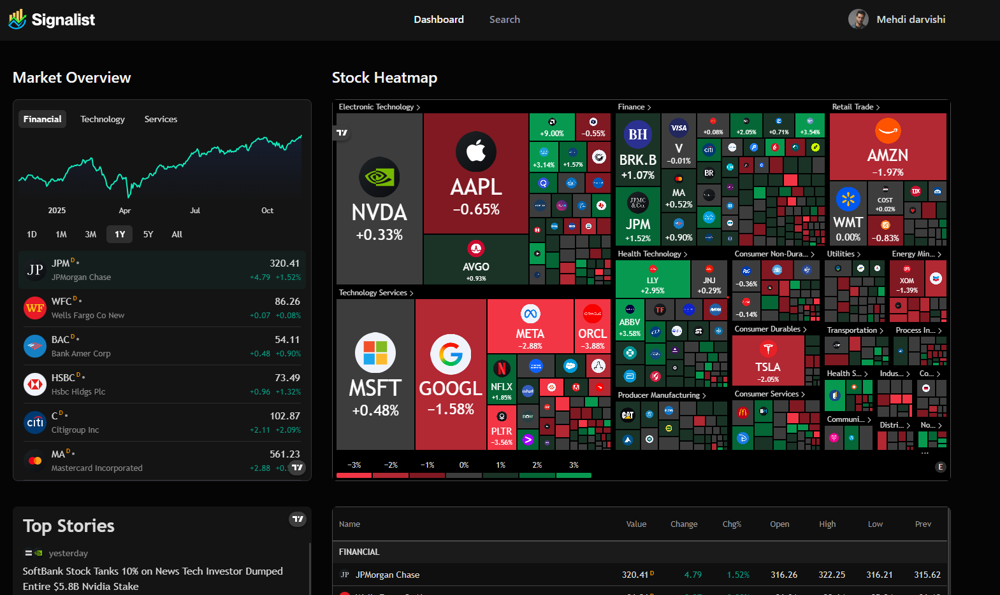
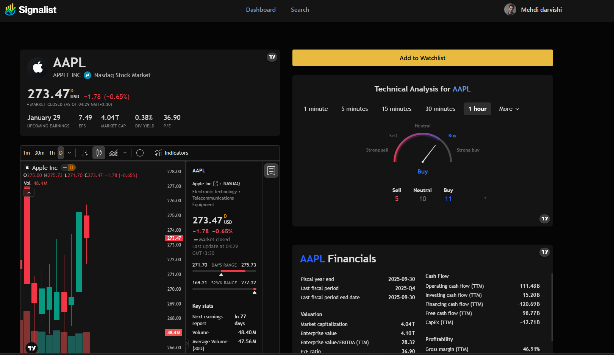

# Stock Market

A real-time application for monitoring cryptocurrency prices, featuring user authentication (login/signup) and automated welcome emails.

## 🚀 Live Demo

**[https://your-live-demo-link.com/](https://stock-market-beryl.vercel.app/)**

*(Note: This is a placeholder link and should be replaced with your final deployment URL.)*

## 📸 Visual Preview

| Main Dashboard (Dark Mode) | Stock Market |
| :---: | :---: |
|  |  |
| *The main dashboard view with real-time price tracking.* | *The user login and registration page.* |

*(Note: Please place your screenshots named `dashboard.png` and `login.png` in a `.github` folder at the root of your project.)*

## 📝 Project Overview

This project is a full-stack dashboard application built to simulate and monitor real-time stock and cryptocurrency markets. It is built with modern technologies including Next.js 16, React 19, and TailwindCSS, fetching live data directly from the Finnhub API.

The primary goal was to integrate several modern technologies to create a robust user experience. The application includes a complete and secure authentication system using `better-auth`, real-time data display, and asynchronous background job processing with `Inngest`. Tasks such as sending automated welcome emails and daily market news summaries to users are managed via `Nodemailer` and `Inngest`. The project uses MongoDB as its database and features a sleek, responsive, **dark-mode-first** user interface.

## ✨ Key Features

* **📈 Real-time Data:** Fetches and displays real-time cryptocurrency prices using the Finnhub API.
* **🔑 Full Authentication:** A comprehensive user sign-up and login system powered by `better-auth`.
* **📧 Automated Emails:**
    * Sends welcome emails to new users upon registration.
    * Distributes daily market news emails to users.
    * All email tasks are managed by `Nodemailer`.
* **🕒 Background Job Management:** Uses `Inngest` to manage scheduled and background jobs (like sending emails), keeping the application fast and responsive.
* **🎨 Dark Mode:** A modern, unified UI designed entirely for Dark Mode (with `next-themes` for theme management).
* **📱 Responsive Design:** A fully responsive interface built with TailwindCSS and Radix UI components.
* **✅ Form Validation:** Client-side form management and validation using `react-hook-form`.
* **🔔 Toast Notifications:** Clean and informative toast notifications powered by `sonner`.

## 🛠️ Tech Stack & Libraries

* **Framework:** Next.js (v16) & React (v19)
* **Language:** TypeScript
* **Database:** MongoDB (with `mongoose`)
* **Styling:** TailwindCSS
* **UI Components:** Radix UI (headless components), `lucide-react` (icons)
* **Authentication:** `better-auth`
* **Form Management:** `react-hook-form`
* **Background Jobs:** `Inngest`
* **Emailing:** `Nodemailer`
* **Financial Data API:** Finnhub API
* **Notifications:** `sonner`
* **Theme Management:** `next-themes`

## ⚙️ How to Run Locally

1.  **Clone the repository:**
    ```bash
    git clone [https://github.com/mahdi-darvishi/Stock-Market.git](https://github.com/mahdi-darvishi/Stock-Market.git)
    cd Stock-Market
    ```
2.  **Install dependencies:**
    ```bash
    npm install
    ```
3.  **Set up environment variables:**
    Create a `.env` file in the project root and fill it with your own values:
    ```env
    NODE_ENV="development"
    NEXT_PUBLIC_BASE_URL="http://localhost:3000"
    
    # Database
    MONGODB_URI="your_mongodb_connection_string"
    
    # Authentication (Better Auth)
    BETTER_AUTH_SECRET="your_strong_secret_key"
    BETTER_AUTH_URL="http://localhost:3000"
    
    # Nodemailer (for sending emails)
    NODEMAILER_EMAIL="your_email@gmail.com"
    NODEMAILER_PASSWORD="your_email_app_password"
    
    # Inngest
    INNGEST_EVENT_KEY="your_inngest_event_key"
    
    # Finnhub API (Real-time stock data)
    NEXT_PUBLIC_FINNHUB_API_KEY="your_finnhub_api_key"
    ```
4.  **Run Inngest (for background jobs):**
    ```bash
    npx inngest-cli@latest dev
    ```
5.  **Run the development server:**
    ```bash
    npm run dev
    ```
    The application will be available at `http://localhost:3000`.

## 🏛️ Architectural Decisions

* **`Inngest` for Background Jobs:** A key decision was to decouple heavy, time-consuming tasks (like sending welcome emails or daily news) from the main request-response cycle. When a user signs up, an "event" is fired, and the app responds immediately. `Inngest` then processes the email task asynchronously in the background. This architecture keeps the application fast and responsive.

* **Choosing `better-auth`:** Instead of more complex solutions, `better-auth` was chosen for authentication. It provides a modern, lightweight, and easy-to-integrate solution for Next.js that perfectly covers the project's needs (signup, login, session management).

* **`Radix UI` + `TailwindCSS`:** Rather than a heavy, pre-styled component library (like MUI), this project uses a combination of `Radix UI` and `TailwindCSS`. `Radix UI` provides accessible, headless base components, while `TailwindCSS` allows for rapid, custom, and optimized styling (especially for dark mode).

* **`Nodemailer`:** To have full control over the email sending process (including using a custom SMTP service), `Nodemailer` was chosen to be called directly (and triggered by `Inngest`).

## 👨‍💻 Author

* **Developed by:** Mehdi Darvishi
